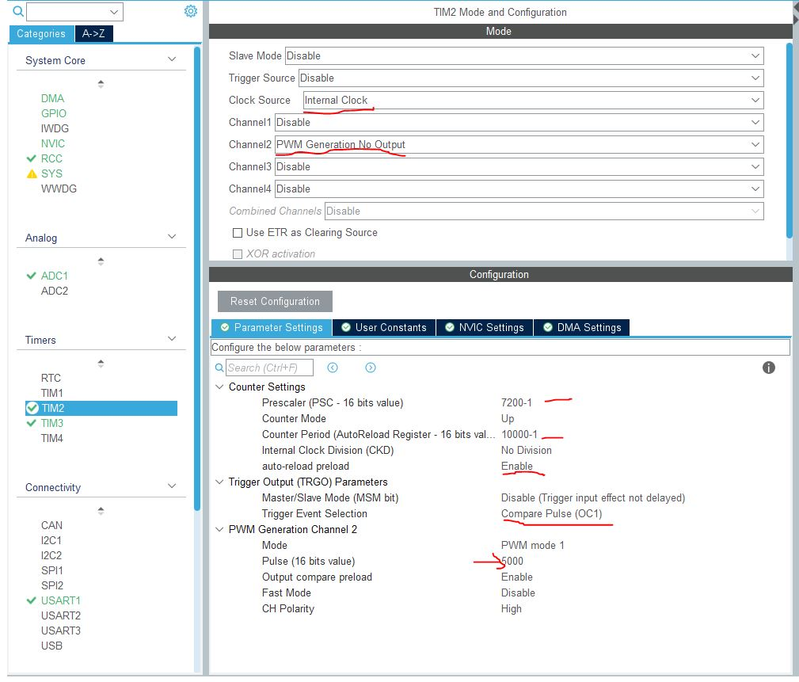
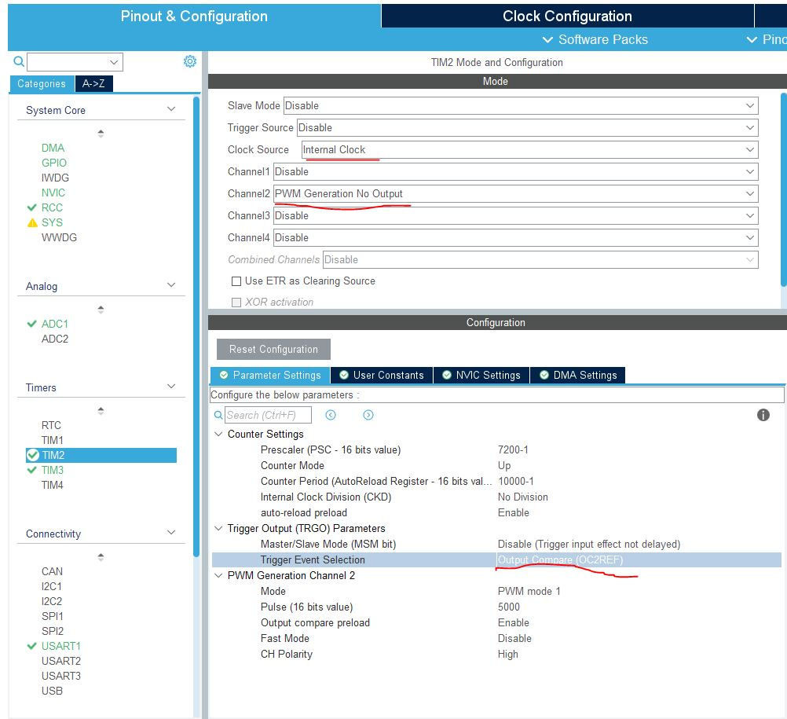
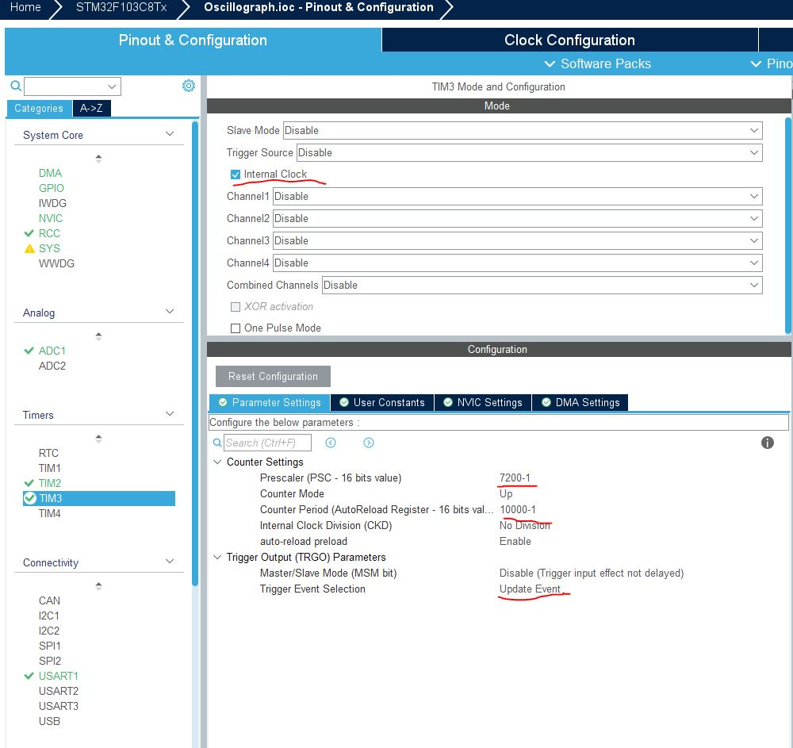

<center class="title"> 基于hal库实现ADC多通道DMA转运，同时实现TIM事件定时触发ADC </center>
<br/>
<p class="title_1">① 配置ADC同时以定时器（TIM2）的输出比较事件作为触发源 ：</p>


>ADC配置


<br/>

>TIMER配置（主频率：72MHz）
 
###### 以下关于配置TIM的事件时可以选择以下两种的其中一种：

##### ①


##### ②


>main函数编写

```c
#define ADC_BUFFER_LEN 100
extern uint16_t ADC_Buffer[ADC_BUFFER_LEN];

HAL_TIM_PWM_Start_IT(&htim2, TIM_CHANNEL_2);
HAL_ADCEx_Calibration_Start(&hadc1);
HAL_ADC_Start(&hadc1);
HAL_ADC_Start_DMA(&hadc1, (uint32_t *)&ADC_Buffer, ADC_BUFFER_LEN);

while(1)
{
    // 按此配置，数组ADC_Buffer将每隔1s插入两个数据，第一个是ch0通道的ADC值，第二个是ch1通道的ADC值，即ADC_Buffer数组偶数为ch0，奇数为ch1
}


// 找到该DMA回调函数，该函数在转运 ADC_BUFFER_LEN /2 个数据（此处因为两个通道，每次转运两个数据）时进入该回调函数

/**
  * @brief This function handles DMA1 channel1 global interrupt.
  */
void DMA1_Channel1_IRQHandler(void)
{
  /* USER CODE BEGIN DMA1_Channel1_IRQn 0 */

  /* USER CODE END DMA1_Channel1_IRQn 0 */
  HAL_DMA_IRQHandler(&hdma_adc1);
  /* USER CODE BEGIN DMA1_Channel1_IRQn 1 */

  /* USER CODE END DMA1_Channel1_IRQn 1 */
}


```


<p class="title_1">② 配置ADC同时以定时器（TIM3）的更新事件作为触发源 ：</p>

>ADC配置

<h5>就如图下划线与上述不同，其他一致</h5>


>TIM3配置（主频率：72MHz）



>main函数编写

```c
#define ADC_BUFFER_LEN 100
extern uint16_t ADC_Buffer[ADC_BUFFER_LEN];

HAL_TIM_Base_Start_IT(&htim3);
HAL_ADCEx_Calibration_Start(&hadc1); // 校准ADC
HAL_ADC_Start(&hadc1);
HAL_ADC_Start_DMA(&hadc1, (uint32_t *)&ADC_Buffer, ADC_BUFFER_LEN);

while(1)
{
    // 按此配置，数组ADC_Buffer将每隔1s插入两个数据，第一个是ch0通道的ADC值，第二个是ch1通道的ADC值，即ADC_Buffer数组偶数为ch0，奇数为ch1
}


// 找到该DMA回调函数，该函数在转运 ADC_BUFFER_LEN /2 个数据（此处因为两个通道，每次转运两个数据）时进入该回调函数

/**
  * @brief This function handles DMA1 channel1 global interrupt.
  */
void DMA1_Channel1_IRQHandler(void)
{
  /* USER CODE BEGIN DMA1_Channel1_IRQn 0 */

  /* USER CODE END DMA1_Channel1_IRQn 0 */
  HAL_DMA_IRQHandler(&hdma_adc1);
  /* USER CODE BEGIN DMA1_Channel1_IRQn 1 */

  /* USER CODE END DMA1_Channel1_IRQn 1 */
}


```
<style>
    .title {
        color: #007acc;
        font-size: 15px;
    }
    .title_1{
        font-size: 12px;
        color:#fea824;
    }
    .image{
        width: 90%;
        margin-left:5%;
        margin: 10px 0 20px 0;
    }
</style>